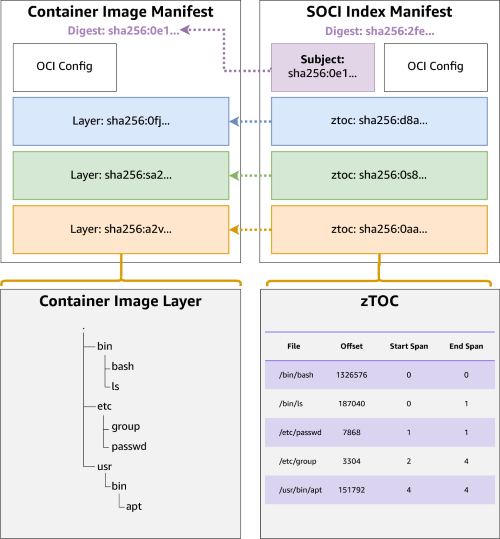
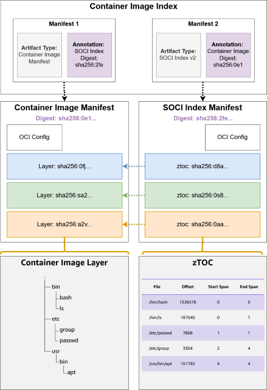

# SOCI Index for AWS Deep Learning Containers

## Background on SOCI Index

The Software Component Index (SOCI) is a technology that enables efficient container image management through selective file downloading. It uses a layer-based indexing system to map file locations within container images, allowing containers to start with only the necessary files loaded (lazy loading). This approach significantly reduces network bandwidth usage and improves container startup times, making it particularly valuable for organizations managing large container images in cloud environments.

A SOCI index, which enables lazy loading of container images, consists of two key components:

1. **SOCI Index Manifest**: Lists zTOCs and references the target image
2. **zTOCs (Zone Table of Contents)**: Comprising:
   - **TOC**: A table of contents containing file metadata and corresponding offset information in the decompressed TAR archive
   - **zInfo**: A collection of checkpoints representing compression engine states at various points in the layer

## SOCI Index Manifest V1 vs V2

SOCI Index Manifest v1 and SOCI Index Manifest v2 both allow lazily loading container images. SOCI Index Manifest v1 is a standalone artifact that can be discovered using the OCI Referrers API. SOCI Index Manifest v2 uses SOCI-enabled images where the SOCI index is bundled with the original image into a single, multi-architecture image. The SOCI snapshotter v0.10.0 will no longer consume SOCI Index Manifest v1 by default. DLC uses v2 SOCI index.

| Feature | SOCI Index V1 | SOCI Index V2 |
|---------|---------------|---------------|
| Structure | Separate artifact from container image | Bound to container image via image index |
| Relationship | Loose coupling through Subject metadata | Direct link through image index |
| Image Modification | No modification required | Requires image index modification |
| Management | Challenges with replication, deletion, and consistency | Improved scalability and consistency |

 

## DLC SOCI Supported Frameworks

Deep Learning Containers (DLC) team provides SOCI index for the following images both in private registry and [public gallery](https://gallery.ecr.aws/deep-learning-containers): PyTorch Training (x86, arm64), vLLM (x86, arm64), and SGLang.

### Sample URIs

- **ECR Private Registry** (requires AWS account to login):
  ```
  763104351884.dkr.ecr.us-east-1.amazonaws.com/pytorch-training:2.9-cpu-py312-ubuntu22.04-sagemaker-v1-soci
  ```

- **ECR Public Gallery** (no login required):
  ```
  public.ecr.aws/deep-learning-containers/pytorch-training:2.9-cpu-py312-ubuntu22.04-sagemaker-v1-soci
  ```

### DLC SOCI Tag Introduction

For different tracking purposes, DLC images have several tags for one single image. Taking PyTorch training image as an example, it has six tags. Tags without version or with only major version will be overridden by each patch release and always point to the latest release image, while tags with minor version and timestamp will only attach to one specific image.

**Tags attached to specific image:**
- `2.9.0-gpu-py312-cu130-ubuntu22.04-ec2-v1.2-2025-12-15-22-03-41`
- `2.9.0-gpu-py312-cu130-ubuntu22.04-ec2-v1.2`

**Tags always attached to latest image:**
- `2.9-gpu-py312-ec2`
- `2.9-gpu-py312-cu130-ubuntu22.04-ec2-v1`
- `2.9.0-gpu-py312-ec2`
- `2.9.0-gpu-py312-cu130-ubuntu22.04-ec2`

**Usage Guidelines:**
- To use a specific image, use tags with timestamp and minor version
- To always get the latest image with CVE patches, use tags without timestamp

**SOCI-Enabled Tags:**

For SOCI index enabled images, DLC adds `-soci` as a tag suffix. For the above image examples, the SOCI tags are:

**Tags attached to specific image:**
- `2.9.0-gpu-py312-cu130-ubuntu22.04-ec2-v1.2-2025-12-15-22-03-41-soci`
- `2.9.0-gpu-py312-cu130-ubuntu22.04-ec2-v1.2-soci`

**Tags always attached to latest image:**
- `2.9-gpu-py312-ec2-soci`
- `2.9-gpu-py312-cu130-ubuntu22.04-ec2-v1-soci`
- `2.9.0-gpu-py312-ec2-soci`
- `2.9.0-gpu-py312-cu130-ubuntu22.04-ec2-soci`

### Supported Versions

For the latest version releases, please refer to our [release notes](https://docs.aws.amazon.com/deep-learning-containers/latest/devguide/dlc-release-notes.html).

| Repository Name | Tags |
|-----------------|------|
| pytorch-training | 2.9-cpu-py312-ubuntu22.04-sagemaker-v1-soci<br>2.9-gpu-py312-cu130-ubuntu22.04-sagemaker-v1-soci<br>2.9-cpu-py312-ubuntu22.04-ec2-v1-soci<br>2.9-gpu-py312-cu130-ubuntu22.04-ec2-v1-soci<br>2.8-cpu-py312-ubuntu22.04-sagemaker-v1-soci<br>2.8-gpu-py312-cu129-ubuntu22.04-sagemaker-v1-soci<br>2.8-cpu-py312-ubuntu22.04-ec2-v1-soci<br>2.8-gpu-py312-cu129-ubuntu22.04-ec2-v1-soci<br>2.7-cpu-py312-ubuntu22.04-sagemaker-v1-soci<br>2.7-gpu-py312-cu128-ubuntu22.04-sagemaker-v1-soci<br>2.7-cpu-py312-ubuntu22.04-ec2-v1-soci<br>2.7-gpu-py312-cu128-ubuntu22.04-ec2-v1-soci |
| pytorch-training-arm64 | 2.7-gpu-py312-cu128-ubuntu22.04-ec2-v1-soci |
| vllm-arm64 | 0.10-gpu-py312-cu129-ubuntu22.04-ec2-v1-soci |
| vllm | 0.10-gpu-py312-cu128-ubuntu22.04-rayserve-ec2-v1-soci<br>0.11-gpu-py312-cu129-ubuntu22.04-ec2-v1-soci<br>0.11-gpu-py312-cu129-ubuntu22.04-sagemaker-v1-soci<br>0.12-gpu-py312-cu129-ubuntu22.04-ec2-v1-soci<br>0.12-gpu-py312-cu129-ubuntu22.04-sagemaker-v1-soci |
| sglang | 0.5-gpu-py312-cu129-ubuntu22.04-sagemaker-v1-soci |

## Getting Started with SOCI Index

### Environment

- **Instance Type**: c5.24xlarge
- **AMI**: Deep Learning Base OSS Nvidia Driver GPU AMI (Amazon Linux 2023) 20250701

### Dependencies

The SOCI snapshotter has the following runtime dependencies:

#### 1. containerd (>= 1.4)

Required to run the SOCI snapshotter. To verify your containerd version:

```bash
containerd --version
# Expected output:
# containerd github.com/containerd/containerd/v2 2.0.5 fb4c30d4ede3531652d86197bf3fc9515e5276d9
```

#### 2. nerdctl (>= v1.6.0)

Required to interact with containerd/registry. **Note**: SOCI will not work with rootless nerdctl.

To install nerdctl:

```bash
wget https://github.com/containerd/nerdctl/releases/download/v2.1.5/nerdctl-2.1.5-linux-amd64.tar.gz
sudo tar -C /usr/local/bin -xzf nerdctl-2.1.5-linux-amd64.tar.gz
sudo chmod +x /usr/local/bin/nerdctl

# Verify installation
nerdctl --version
# Expected output:
# nerdctl version 2.1.5
```

#### 3. fuse

Used for mounting without root access.

```bash
sudo yum install fuse
```

### Install the SOCI Snapshotter

The SOCI project produces 2 binaries:
- **soci**: The CLI tool used to build/manage SOCI indices
- **soci-snapshotter-grpc**: The daemon (a containerd snapshotter plugin) used for lazy loading

**Note**: Each soci-snapshotter binary is compiled with a specific glibc version. Check your system glibc version for compatibility.

To check glibc version:

```bash
ldd --version
# Expected output:
# ldd (GNU libc) 2.34
# Copyright (C) 2021 Free Software Foundation, Inc.
# This is free software; see the source for copying conditions. There is NO
# warranty; not even for MERCHANTABILITY or FITNESS FOR A PARTICULAR PURPOSE.
# Written by Roland McGrath and Ulrich Drepper.
```

To install soci-snapshotter:

```bash
version="0.12.1"
wget https://github.com/awslabs/soci-snapshotter/releases/download/v${version}/soci-snapshotter-${version}-linux-amd64.tar.gz
sudo tar -C /usr/local/bin -xvf soci-snapshotter-${version}-linux-amd64.tar.gz soci soci-snapshotter-grpc

# Verify installation
soci --version
# Expected output:
# soci version v0.12.1 c140af2f22fffade79af74ddcc1c29388d763051
```

### Configure soci-snapshotter

#### Step 1: Start Snapshotter in Background

```bash
sudo mkdir -p /run/soci-snapshotter-grpc

# Start the SOCI snapshotter in background
sudo /usr/local/bin/soci-snapshotter-grpc &
```

**Expected output:**

```json
{"level":"info","msg":"starting soci-snapshotter-grpc","revision":"c140af2f22fffade79af74ddcc1c29388d763051","time":"2025-12-16T23:54:48.995428161Z","version":"v0.12.1"}
{"emitMetricPeriod":10000000000,"fetchPeriod":500000000,"level":"info","maxQueueSize":100,"msg":"constructing background fetcher","silencePeriod":30000000000,"time":"2025-12-16T23:54:49.007876736Z"}
{"address":"/run/soci-snapshotter-grpc/soci-snapshotter-grpc.sock","level":"info","msg":"soci-snapshotter-grpc successfully started","time":"2025-12-16T23:54:49.011089880Z"}
```

Verify the snapshotter is running:

```bash
ps aux | grep soci-snapshotter
```

**Expected output:**

```
root       12809  0.0  0.0 234584  8084 pts/1    S    23:54   0:00 sudo /usr/local/bin/soci-snapshotter-grpc
root       12812  0.0  0.0 234584  2516 pts/2    Ss+  23:54   0:00 sudo /usr/local/bin/soci-snapshotter-grpc
root       12813  0.0  0.0 2317432 42584 pts/2   Sl   23:54   0:00 /usr/local/bin/soci-snapshotter-grpc
ec2-user   12875  0.0  0.0 222324  2124 pts/1    S+   23:55   0:00 grep --color=auto soci-snapshotter
```

#### Step 2: Configure containerd to Use SOCI Plugin

Modify `/etc/containerd/config.toml`:

```bash
sudo vim /etc/containerd/config.toml
```

Ensure the config includes the following section:

```toml
[proxy_plugins]
  [proxy_plugins.soci]
    type = "snapshot"
    address = "/run/soci-snapshotter-grpc/soci-snapshotter-grpc.sock"
```

#### Step 3: Verify nerdctl is Using SOCI

```bash
sudo nerdctl system info
```

Look for `soci` in the Storage plugins:

```
Client:
 Namespace:     default
 Debug Mode:    false

Server:
 Server Version: 2.0.5
 Storage Driver: overlayfs
 Logging Driver: json-file
 Cgroup Driver: systemd
 Cgroup Version: 2
 Plugins:
  Log:     fluentd journald json-file none syslog
  Storage: native overlayfs soci
 Security Options:
  seccomp
   Profile: builtin
  cgroupns
 Kernel Version:   6.1.141-155.222.amzn2023.x86_64
 Operating System: Amazon Linux 2023.7.20250623
 OSType:           linux
 Architecture:     x86_64
 CPUs:             96
 Total Memory:     184.9GiB
 Name:             ip-172-31-53-55.us-west-2.compute.internal
 ID:               cafd1e17-3c20-4557-af0d-425ea0ef25bc
```

### Pull SOCI Index Supported Image with SOCI Snapshotter

```bash
sudo nerdctl pull --snapshotter soci public.ecr.aws/deep-learning-containers/pytorch-training:2.9-gpu-py312-cu130-ubuntu22.04-ec2-v1-soci
```

**Output:**

```
public.ecr.aws/deep-learning-containers/pytorch-training:2.9-gpu-py312-cu130-ubuntu22.04-ec2-v1-soci: resolved       |++++++++++++++++++++++++++++++++++++++| 
index-sha256:fbacb61760f570e2f8df6eacd65a6285c8699405566fdb73711390e9d81db2b8:    done           |++++++++++++++++++++++++++++++++++++++| 
manifest-sha256:ca3e4389bb850cf3f43128b98897ac4522e20f354452a41139cfe7f45431da22:     done           |++++++++++++++++++++++++++++++++++++++| 
config-sha256:d007250deb6300c72286af12cf0510cf69b0c7227e4b4d50783a03ac8d917275:       done           |++++++++++++++++++++++++++++++++++++++| 
elapsed: 8.9 s     total:  37.9 K (4.3 KiB/s)
```

Verify the image:

```bash
sudo nerdctl images
```

**Output:**

```
REPOSITORY                                                  TAG                                            IMAGE ID        CREATED          PLATFORM       SIZE    BLOB SIZE
public.ecr.aws/deep-learning-containers/pytorch-training    2.9-gpu-py312-cu130-ubuntu22.04-ec2-v1-soci    fbacb61760f5    5 minutes ago    linux/amd64    0B      8.792GB
```

**FUSE mount output:**

```json
{"level":"info","msg":"fuse operation count for image sha256:ca3e4389bb850cf3f43128b98897ac4522e20f354452a41139cfe7f45431da22: node.Getxattr = 13","time":"2025-12-17T00:06:33.005689642Z"}
{"level":"info","msg":"fuse operation count for image sha256:ca3e4389bb850cf3f43128b98897ac4522e20f354452a41139cfe7f45431da22: node.Open = 0","time":"2025-12-17T00:06:33.005771355Z"}
{"level":"info","msg":"fuse operation count for image sha256:ca3e4389bb850cf3f43128b98897ac4522e20f354452a41139cfe7f45431da22: node.Readlink = 0","time":"2025-12-17T00:06:33.005780603Z"}
{"level":"info","msg":"fuse operation count for image sha256:ca3e4389bb850cf3f43128b98897ac4522e20f354452a41139cfe7f45431da22: whiteout.Getattr = 0","time":"2025-12-17T00:06:33.005788862Z"}
{"level":"info","msg":"fuse operation count for image sha256:ca3e4389bb850cf3f43128b98897ac4522e20f354452a41139cfe7f45431da22: node.Listxattr = 0","time":"2025-12-17T00:06:33.005798239Z"}
{"level":"info","msg":"fuse operation count for image sha256:ca3e4389bb850cf3f43128b98897ac4522e20f354452a41139cfe7f45431da22: node.Lookup = 0","time":"2025-12-17T00:06:33.005805635Z"}
{"level":"info","msg":"fuse operation count for image sha256:ca3e4389bb850cf3f43128b98897ac4522e20f354452a41139cfe7f45431da22: node.Readdir = 0","time":"2025-12-17T00:06:33.005813816Z"}
{"level":"info","msg":"fuse operation count for image sha256:ca3e4389bb850cf3f43128b98897ac4522e20f354452a41139cfe7f45431da22: file.Read = 0","time":"2025-12-17T00:06:33.005824207Z"}
{"level":"info","msg":"fuse operation count for image sha256:ca3e4389bb850cf3f43128b98897ac4522e20f354452a41139cfe7f45431da22: file.Getattr = 0","time":"2025-12-17T00:06:33.005831686Z"}
{"level":"info","msg":"fuse operation count for image sha256:ca3e4389bb850cf3f43128b98897ac4522e20f354452a41139cfe7f45431da22: node.Getattr = 13","time":"2025-12-17T00:06:33.005839399Z"}
```

### Run Containers with SOCI Snapshotter

#### Understanding Snapshotter Behavior

**With `--snapshotter soci` flag:**
- Uses SOCI lazy loading mechanism
- Only downloads necessary layers initially
- Fetches additional layers on-demand during runtime
- Faster time from pull to run
- Best for large images where you want immediate startup

**Without `--snapshotter soci` flag:**
- Uses default overlayfs snapshotter
- Must download ALL image layers before container can start
- No lazy loading benefits
- Takes significantly longer to pull the complete image (e.g., 4m26s for 17.6GB image)
- Container will work normally once all layers are downloaded

**Example comparison:**

```bash
# WITHOUT --snapshotter soci (will need to download all layers)
sudo nerdctl run -it --rm --network host public.ecr.aws/deep-learning-containers/pytorch-training:2.9-gpu-py312-cu130-ubuntu22.04-ec2-v1-soci /bin/bash
# This will download the ENTIRE image (~17.6GB) before running

# WITH --snapshotter soci (lazy loading enabled)
sudo nerdctl run --snapshotter soci -it --rm --network host public.ecr.aws/deep-learning-container
s/pytorch-training:2.9-gpu-py312-cu130-ubuntu22.04-ec2-v1-soci /bin/bash
# This will use the SOCI index and only download necessary layers
```

**Recommendation**: Always use `--snapshotter soci` flag with SOCI-enabled images (images with `-soci` suffix) to benefit from lazy loading. The flag is required to activate the SOCI lazy loading mechanism.

#### Basic Run Command

```bash
sudo nerdctl run --snapshotter soci --rm --network host public.ecr.aws/deep-learning-containers/pytorch-training:2.9-gpu-py312-cu130-ubuntu22.04-ec2-v1-soci 'python -c "import torch; print(torch.__version__)"'
```

**Output:**

```
2.9.0+cu130
```

#### Interactive Container

To run an interactive container with SOCI:

```bash
sudo nerdctl run --snapshotter soci -it --rm public.ecr.aws/deep-learning-containers/pytorch-training:2.9-gpu-py312-cu130-ubuntu22.04-ec2-v1-soci /bin/bash
```

**Note**: When using SOCI snapshotter to run containers, the lazy loading mechanism will fetch additional layers on-demand as the application accesses files that weren't included in the initial pull. This is why you may see slightly longer initial run times compared to fully-pulled images, but the overall time from pull to run is significantly faster.

## Performance Comparison: SOCI vs Docker

### Docker Pull Benchmark

```bash
time docker pull public.ecr.aws/deep-learning-containers/pytorch-training:2.9-gpu-py312-cu130-ubuntu22.04-ec2-v1
```

**Output:**

```
real    4m26.405s
user    0m0.129s
sys     0m0.127s
```

```bash
docker images
```

**Output:**

```
REPOSITORY                                                 TAG                                           IMAGE ID       CREATED        SIZE
public.ecr.aws/deep-learning-containers/pytorch-training   2.9-gpu-py312-cu130-ubuntu22.04-ec2-v1        d007250deb63   32 hours ago   17.6GB
```

**Analysis**: The image size is 17.6GB. Using Docker to pull the full image takes **4m26.405s**, while SOCI only pulls the index and necessary layers, taking just **8.9s**. The remaining layers are pulled during runtime as needed.

### Container Runtime Comparison

#### Docker Runtime

```bash
time docker run public.ecr.aws/deep-learning-containers/pytorch-training:2.9-gpu-py312-cu130-ubuntu22.04-ec2-v1 'python -c "import torch; print(torch.__version__)"'
```

**Output:**

```
bash: cannot set terminal process group (-1): Inappropriate ioctl for device
bash: no job control in this shell
2.9.0+cu130

real    0m4.308s
user    0m0.010s
sys     0m0.023s
```

#### SOCI Runtime

```bash
time sudo nerdctl run --snapshotter soci --rm --network host public.ecr.aws/deep-learning-containers/pytorch-training:2.9-gpu-py312-cu130-ubuntu22.04-ec2-v1 'python -c "import torch; print(torch.__version__)"'
```

**Output:**

```
public.ecr.aws/deep-learning-containers/pytorch-training:2.9-gpu-py312-cu130-ubuntu22.04-ec2-v1: resolved       |++++++++++++++++++++++++++++++++++++++| 
manifest-sha256:10f1280343bfe3e9acb43bbcf2ac78e0bf636df6181c1dbbfa6e84ac285d0948:    done           |++++++++++++++++++++++++++++++++++++++| 
config-sha256:d007250deb6300c72286af12cf0510cf69b0c7227e4b4d50783a03ac8d917275:      exists         |++++++++++++++++++++++++++++++++++++++| 
elapsed: 0.3 s     total:  7.3 Ki (24.3 KiB/s)                                      
bash: cannot set terminal process group (-1): Inappropriate ioctl for device
bash: no job control in this shell
2.9.0+cu130

real    0m22.785s
user    0m0.020s
sys     0m0.031s
```

### Key Performance Benefits

- **Faster Initial Pull**: SOCI reduces initial pull time from 4m26s to 8.9s (~97% reduction)
- **Reduced Bandwidth**: Only pulls necessary layers during initial pull
- **Lazy Loading**: Additional layers are fetched on-demand during runtime
- **Storage Efficiency**: Reduces initial storage footprint while maintaining full functionality
