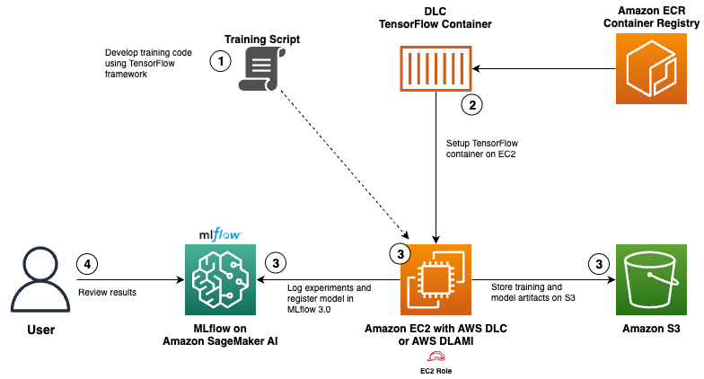
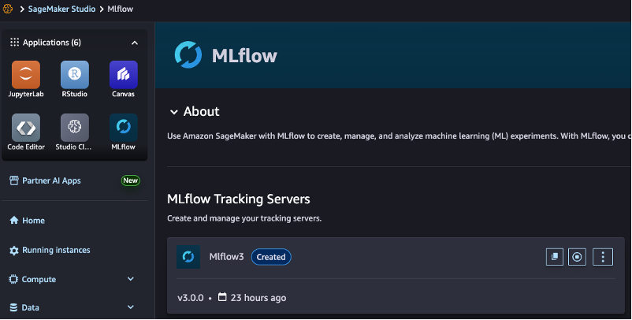
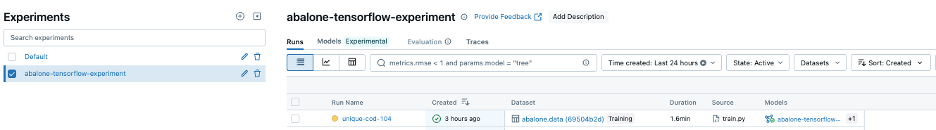
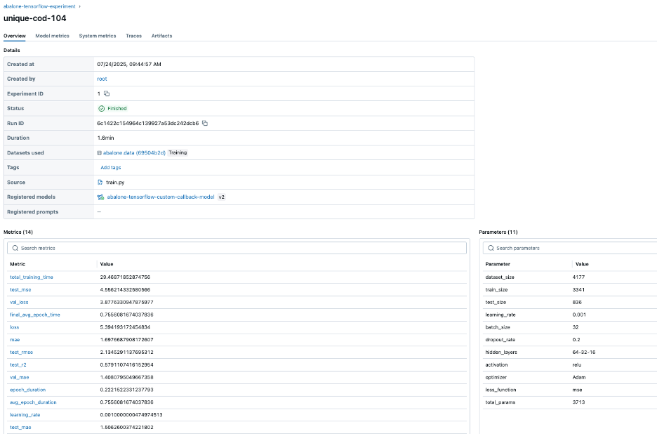
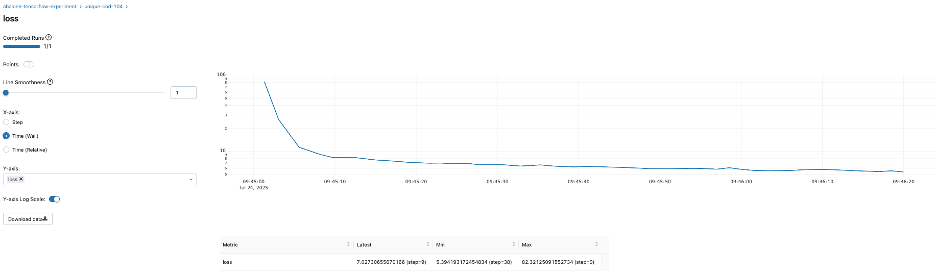
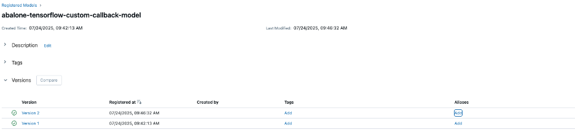
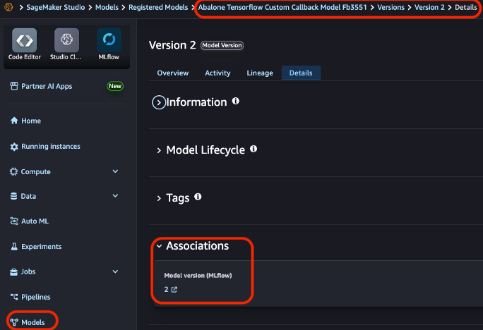
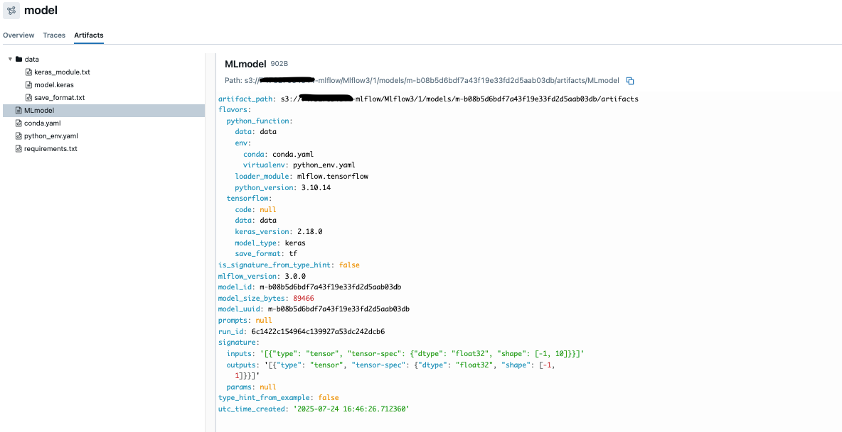

# Using AWS Deep Learning Containers with MLflow on Amazon SageMaker AI

This project demonstrates how to train a TensorFlow model to predict abalone age using AWS Deep Learning Containers (DLC) and track experiments with Amazon SageMaker MLflow.

## Project Overview

The Abalone dataset contains physical measurements of abalone (marine snails) used to predict their age. This machine learning model predicts age based on features like length, diameter, height, and various weight measurements using a TensorFlow neural network with comprehensive MLflow experiment tracking.

## Solution Architecture

*Figure 1: Architecture diagram that shows the interaction between various AWS services, AWS DLC and MLflow for the solution.*



## Workflow Overview

1. **Model development with MLflow integration**
   1. Develop a TensorFlow neural network model for abalone age prediction
   2. Integrate MLflow tracking within the model code to log parameters, metrics, and artifacts

2. **Container Setup and Configuration on EC2**
   1. Pull an optimized TensorFlow training container from AWS's public ECR repository
   2. Configure the EC2 / DLAMI with access to the MLflow tracking server using an IAM role for EC2

3. **Execute model training**
   1. Execute the training process within the DLC running on EC2
   2. Store model artifacts on S3
   3. Log all experiment results and register model in MLflow

4. **Review results**
   1. Compare experiment results through the MLflow interface / SageMaker Studio interface

## Prerequisites

To follow along with this walkthrough, make sure you have the following prerequisites:

- **AWS account** with billing enabled
- **EC2 instance** (t3.large or larger) running Ubuntu 20.4 or later with at least 20GB of available disk space for Docker images and containers
- **Docker** (latest) installed on the EC2 instance
- **AWS Command Line Interface (AWS CLI)** (2.0 or later)
- **IAM role** with permissions for:
  - Role for Amazon EC2 to talk to Amazon SageMaker MLflow
  - Amazon ECR (to pull the TensorFlow container)
  - Amazon SageMaker MLflow (to track experiments and register models)
- **Amazon SageMaker AI Studio domain** - To create a domain, refer to [Guide to getting set up with Amazon SageMaker AI](https://docs.aws.amazon.com/sagemaker/latest/dg/gs-studio-onboard.html)
  - Add `sagemaker-mlflow:AccessUI` permission to the SageMaker execution role created. This permission will allow you to navigate to MLflow 3.0 from SageMaker AI Studio console
- **MLflow 3.0 tracking server** set up in SageMaker AI
- **Internet access** from the EC2 instance to download the abalone dataset
- **GitHub repository** cloned to your EC2 instance

## Step-by-Step Implementation

The following steps will walk you through the entire process, from provisioning infrastructure and setting up permissions to executing your first training job with comprehensive experiment tracking.

### Step 1: EC2 Instance Setup

1. **Log in to the AWS Management Console** and navigate to EC2
2. **Click "Launch Instance"** - Refer to the [AWS documentation](https://docs.aws.amazon.com/AWSEC2/latest/UserGuide/launching-instance.html) on how to launch a new instance
3. **Configure your instance:**
   - **Name:** `aws-dlc-training-instance`
   - **AMI:** Amazon Linux 2023
   - **Instance type:** `t3.large` (recommended for ML workloads)
   - **Key pair:** Create or select an existing key pair
   - **Network settings:** Allow SSH traffic
   - **Storage:** 20 GB gp3 volume

### Step 2: IAM Role Configuration

1. **Navigate to IAM** in the AWS Console
2. **Create a new role** with the following policy:

```json
{
    "Version": "2012-10-17",
    "Statement": [
        {
            "Effect": "Allow",
            "Action": [
                "sagemaker:DescribeMLflowTrackingServer",
                "sagemaker-mlflow:CreateExperiment",
                "sagemaker-mlflow:GetExperiment",
                "sagemaker-mlflow:SearchExperiments",
                "sagemaker-mlflow:CreateRun",
                "sagemaker-mlflow:UpdateRun",
                "sagemaker-mlflow:LogMetric",
                "sagemaker-mlflow:LogParam",
                "sagemaker-mlflow:LogModel",
                "sagemaker-mlflow:CreateRegisteredModel",
                "sagemaker-mlflow:GetExperimentByName",
                "sagemaker-mlflow:GetRun",
                "sagemaker-mlflow:LogOutputs",
                "sagemaker-mlflow:FinalizeLoggedModel",
                "sagemaker-mlflow:GetMetricHistory",
                "sagemaker-mlflow:LogBatch",
                "sagemaker-mlflow:GetLoggedModel",
                "sagemaker-mlflow:CreateModelVersion",
                "sagemaker-mlflow:SetLoggedModelTags",
                "sagemaker-mlflow:LogInputs",
                "sagemaker-mlflow:SetTag"
            ],
            "Resource": "arn:aws:sagemaker:us-east-1:{your-account-number}:mlflow-tracking-server/{your-tracking-server-name}"
        },
        {
            "Effect": "Allow",
            "Action": "ecr:GetAuthorizationToken",
            "Resource": "*"
        },
        {
            "Effect": "Allow",
            "Action": [
                "ecr:BatchCheckLayerAvailability",
                "ecr:GetDownloadUrlForLayer",
                "ecr:BatchGetImage"
            ],
            "Resource": "arn:aws:ecr:us-east-1:763104351884:repository/tensorflow-training"
        },
        {
            "Effect": "Allow",
            "Action": [
                "s3:PutObject"
            ],
            "Resource": [
                "arn:aws:s3:::{your-bucket}/{your-path}/*"
            ]
        }
    ]
}
```

3. **Attach a trust policy** to the role:

```json
{
  "Version": "2012-10-17",
  "Statement": [
    {
      "Effect": "Allow",
      "Principal": {
        "Service": "ec2.amazonaws.com"
      },
      "Action": "sts:AssumeRole"
    }
  ]
}
```

4. **Attach this role to your EC2 instance:**
   - Go to EC2 Dashboard → Instances → Select your instance
   - Actions → Security → Modify IAM role
   - Select the role you created and choose "Update IAM role"

### Step 3: Connect to Your EC2 Instance and Install Required Software

Refer to the [AWS documentation](https://docs.aws.amazon.com/AWSEC2/latest/UserGuide/connect-to-linux-instance.html) to connect to your EC2 instance.

```bash
# Connect to your instance
ssh -i your-key.pem ec2-user@your-instance-public-dns

# Update system packages
sudo yum update -y

# Install Docker
sudo yum install -y docker
sudo systemctl start docker
sudo systemctl enable docker
sudo usermod -aG docker $USER

# Log out and log back in for group changes to take effect
exit

# Reconnect to your instance
ssh -i your-key.pem ec2-user@your-instance-public-dns

# Install Git
sudo yum install -y git

# Install AWS CLI (if not already installed)
curl "https://awscli.amazonaws.com/awscli-exe-linux-x86_64.zip" -o "awscliv2.zip"
unzip awscliv2.zip
sudo ./aws/install
```

### Step 4: Clone the Repository

```bash
# Clone the repository
git clone https://github.com/aws-samples/sample-aws-deep-learning-containers.git 
cd mlflow/dlc-with-mlflow

# Create required directories
mkdir -p data
mkdir -p output
```

### Step 5: Verify the Project Structure

```bash
# List files in the project
ls -la

# Check the training script
cat src/train.py

# Make the training script executable
chmod +x run_training.sh
```

**Expected project structure:**
```
aws-dlc-with-mlflow/
├── src/
│   └── train.py                    # Main training script
├── data/                           # Dataset directory
├── output/                         # Model output directory
├── requirements.txt                # Python dependencies
├── Dockerfile                      # Custom container definition
├── run_training.sh                # Training execution script
├── IAM_permissions.json           # Required AWS permissions
├── IAM_trust_relationship.json    # IAM role trust policy
└── README.md                      # This documentation
```

### Step 6: Update the MLflow ARN in the Training Script

**Note:** See Prerequisites section if you do not have a MLflow tracking server setup.

```bash
# Open the file in a text editor
nano src/train.py

# Find and update this line with your tracking server name
tracking_server_name = "{your-tracking-server-name}"
```

### Step 7: Run the Training Script

```bash
# Execute the training script
./run_training.sh
```

**This script will:**
1. Check for the abalone dataset and download it if needed
2. Authenticate with AWS ECR
3. Pull the TensorFlow training container
4. Run the training script in the container

### Step 8: Monitor the Training Process

The training output will show:
- Dataset loading and preprocessing
- Model architecture
- Training progress with loss and metrics
- Evaluation results
- MLflow logging information

**Example output:**
```
TensorFlow version: 2.18.0
MLflow version: 3.0.0
Loading Abalone dataset...
Loading dataset from /opt/ml/data/abalone.data
...
MLflow tracking server URL: arn:aws:sagemaker:us-east-1:{your-account-id}:mlflow-tracking-server/{your-tracking-server-name}
Using experiment: abalone-tensorflow-experiment
MLflow configured - autolog disabled, using custom callback
MLflow run ID: 6c1422c154964c139927a53dc242dcb6
...
Training the model...
Starting epoch 1
Epoch 1/100
59/84 ━━━━━━━━━━━━━━━━━━━━ 0s 2ms/step - loss: 110.2189 - mae: 9.8295 
Completed epoch 1 in 2.15s
  loss: 82.3213
  mae: 8.2671
  val_loss: 74.2215
  val_mae: 8.1098
  learning_rate: 0.0010000000474974513
...
Registered model 'abalone-tensorflow-custom-callback-model' already exists. Creating a new version of this model...
2025/07/24 16:46:33 INFO mlflow.store.model_registry.abstract_store: Waiting up to 300 seconds for model version to finish creation. Model name: abalone-tensorflow-custom-callback-model, version 2
Created version '2' of model 'abalone-tensorflow-custom-callback-model'.
Model and artifacts logged to MLflow
🏃 View run unique-cod-104 at: https://us-east-1.experiments.sagemaker.aws/#/experiments/1/runs/6c1422c154964c139927a53dc242dcb6
🧪 View experiment at: https://us-east-1.experiments.sagemaker.aws/#/experiments/1
MLflow run 6c1422c154964c139927a53dc242dcb6 completed with custom callback
```

### Step 9: View the Results in MLflow

After the training has completed, the model is registered in MLflow and within SageMaker AI. In the following steps you will access them to view the details, starting with SageMaker AI Studio console:

1. **Access the Amazon SageMaker AI Studio console** and access the domain that was created earlier
2. **Navigate to MLflow** → Tracking servers
3. **Select your MLflow tracking server**

*Figure 2: Landing page for SageMaker Studio UI and access to MLflow*



4. **Click "Open MLflow UI"**
5. **Browse to the "abalone-tensorflow-experiment" experiment**

The following image shows experiment "abalone-tensorflow-experiment" with a run name of "unique-cod-104".

*Figure 3: Experiment "unique-cod-104"*



6. **View the run details, metrics, and artifacts** in MLflow

The following images show details of the experiment run, the training loss and registered model within MLflow and SageMaker AI Studio.

*Figure 4: Details for run name "unique-cod-104". Reference the registered model "abalone-tensorflow-custom-callback-model" and model version of v2.*



*Figure 5: Details of loss by epochs, logged using a custom callback*



*Figure 6: Registered models of "abalone-tensorflow-custom-callback-model".*



When logging a model in MLflow using `mlflow.tensorflow.log_model()` with the `registered_model_name` parameter, the model is automatically registered in Amazon SageMaker Model Registry without additional steps. This seamless integration creates a versioned model entry in SageMaker, complete with signatures and metadata, directly from your MLflow experiment. 

Within your SageMaker Studio UI, under Models, you can find the association under the details tab. The screenshot below illustrates how the model in SageMaker Model Registry ties back to the model logged in MLflow.

*Figure 7: Registered model in SageMaker Model Registry*



*Figure 8: Model artifacts uploaded to S3 after training completion.*



## Resources

- [AWS Deep Learning Containers Documentation](https://docs.aws.amazon.com/deep-learning-containers/)
- [AWS Deep Learning AMIs Documentation](https://docs.aws.amazon.com/dlami/)
- [SageMaker MLflow Documentation](https://docs.aws.amazon.com/sagemaker/latest/dg/mlflow.html)
- [SageMaker AI Studio Setup Guide](https://docs.aws.amazon.com/sagemaker/latest/dg/gs-studio-onboard.html)
- [Abalone Dataset Information](https://archive.ics.uci.edu/ml/datasets/abalone)
- [TensorFlow Documentation](https://www.tensorflow.org/guide)
- [TensorFlow Deep Learning Container Repository](https://github.com/aws/deep-learning-containers/releases?q=%22tf-ec2%22)
