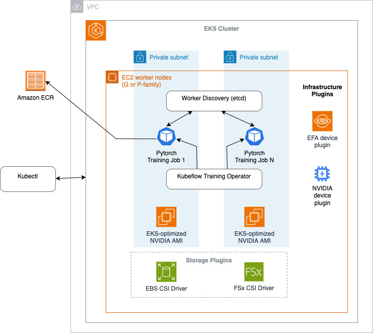

# Distributed Training on Amazon EKS with AWS Deep Learning Containers

In this post, we show how to configure and verify a distributed training cluster using AWS Deep Learning Containers on Amazon Elastic Kubernetes Service (EKS). We demonstrate building a cost-effective, enterprise-scale distributed training environment for large language models using P4d instances, FSx for Lustre storage, and PyTorch FSDP (Fully Sharded Data Parallel), making sure the infrastructure meets production standards. We demonstrate this by setting up a distributed training system that fine-tunes Meta Llama 2 7B using a systematic approach to launch and verify all required components.

This sample consists of the following components:

**Infrastructure Setup** – Deploy EKS cluster with GPU-optimized P4d instances and EFA networking for high-performance distributed training.

**Container Building** – Create custom Docker images based on AWS Deep Learning Containers with additional dependencies for training workloads.

**Plugin Installation** – Configure NVIDIA GPU plugins, EFA networking, distributed training frameworks (etcd, Kubeflow Training Operator), and persistent storage drivers.

**Storage Configuration** – Set up FSx for Lustre high-performance parallel filesystem for training data and model checkpoints.

**Validation & Testing** – Run comprehensive health checks including GPU validation, NCCL communication tests, and sample training workloads.

**Training Orchestration** – Launch distributed PyTorch jobs using FSDP with proper worker coordination and fault handling.

This repository is explained in detail in the AWS blog *"Configuring and Verifying a Distributed Training Cluster  with AWS Deep Learning Containers on Amazon Elastic Kubernetes Service"*

## Code Contains:

The repository includes practical scripts and configurations demonstrating:

- Building custom Docker images from AWS Deep Learning Containers with PyTorch 2.7.1
- Deploying EKS clusters with GPU node groups and EFA-enabled networking using eksctl
- Installing and configuring NVIDIA device plugins, EFA plugins, and distributed training operators
- Setting up FSx for Lustre filesystem for high-throughput storage
- Running NCCL tests to validate multi-node GPU communication
- Launching distributed PyTorch training jobs with FSDP using Kubeflow Training Operator



## Prerequisites

- An AWS account with billing enabled
- AWS CLI configured with appropriate permissions
- Docker installed on build environment
- At least 100 GiB storage for building containers
- Hugging Face token for Llama 2 model access (gated model)
- Optional: EC2 Capacity Reservation for P4d instances
- Deep Learning AMI for container building

## Execution

### Step 1: Environment Setup

Launch an EC2 instance with Deep Learning AMI and install dependencies:

```bash
# Clone this repository
git clone <repository-url>
cd <repository-name>

# Install AWS CLI, kubectl, and eksctl
source ./setup_ec2.sh
```

### Step 2: Build Custom Training Container

```bash
# Build and push custom Docker image with training dependencies
bash ./build.sh
```

### Step 3: Deploy EKS Cluster

```bash
# Create EKS cluster with GPU nodes and required add-ons
eksctl create cluster -f ./eks-p4d-odcr.yaml
```

### Step 4: Install Training Plugins

```bash
# Deploy etcd for worker coordination
kubectl apply -f etcd.yaml

# Install Kubeflow Training Operator
kubectl apply --server-side -k "github.com/kubeflow/training-operator.git/manifests/overlays/standalone?ref=v1.9.3"

# Create FSx filesystem and storage
bash ./fsx_create.sh
kubectl apply -f ./fsx-pvc-static.yaml
```

### Step 5: Validate Environment

```bash
# Verify GPU availability
kubectl apply -f nvidia_smi.yaml
kubectl logs nvidia-smi

# Test NCCL communication
kubectl apply -f nccl-tests.yaml
kubectl get pods | grep nccl
```

### Step 6: Run Distributed Training

```bash
# Configure Hugging Face token in fsdp.conf
# Then launch training job
bash ./fsdp.sh
kubectl apply -f ./fsdp.yaml

# Monitor training progress
kubectl get pods | grep fsdp
kubectl logs -f fsdp-worker-0
```

## Project Structure

```
├── setup_ec2.sh              # EC2 environment setup
├── build.sh                  # Docker image build script
├── Dockerfile.llama2-efa-dlc # Custom training container
├── .env                      # Environment variables
│
├── eks-p4d-odcr.yaml         # EKS cluster configuration
├── eks-p4d.yaml              # Alternative cluster config
├── eks-vpc-odcr-p4d.yaml     # VPC-specific cluster config
│
├── fsx_create.sh             # FSx filesystem creation
├── fsx_deploy.sh             # FSx deployment to EKS
├── fsx_delete.sh             # FSx cleanup
├── fsx-pvc-static.yaml       # FSx persistent volume claim
├── fsx.conf                  # FSx configuration
│
├── fsdp.yaml                 # PyTorch distributed training job
├── fsdp.yaml-template        # Training job template
├── fsdp.sh                   # Training job launcher
├── fsdp.conf                 # Training configuration
│
├── etcd.yaml                 # Worker coordination service
├── nccl-tests.yaml           # Network performance validation
└── nvidia_smi.yaml           # GPU validation job
```

## Configuration Details

All the sample scripts can be adjusted to the needs of specific workloads.

### Cluster Configuration
- **System nodes**: `c5.2xlarge` for cluster management
- **GPU nodes**: `p4d.24xlarge` with EFA networking (8 H100 GPUs per node)
- **Storage**: 500 GiB EBS volumes + FSx for Lustre
- **Networking**: EFA-enabled for high-performance communication
- **Kubernetes**: Version 1.33 with managed node groups

### Training Configuration
- **Model**: Meta Llama 2 7B (gated model - requires HF token)
- **Framework**: PyTorch with FSDP (Fully Sharded Data Parallel)
- **Communication**: NCCL with AWS OFI backend for EFA
- **Storage**: FSx for Lustre for dataset and checkpoints
- **Orchestration**: Kubeflow Training Operator with etcd coordination

## Validation and Testing

The setup includes comprehensive validation steps:

- **GPU Validation**: Verify NVIDIA drivers and GPU visibility
- **Network Testing**: NCCL all-reduce and bandwidth tests
- **Storage Verification**: FSx mount and throughput validation
- **Training Validation**: Sample FSDP job with Llama 2 7B

## Troubleshooting

### Common Issues
- **GPU not visible**: Check NVIDIA device plugin installation
- **EFA not working**: Verify EFA plugin and instance type support
- **Training fails**: Ensure etcd is running and accessible
- **Storage issues**: Verify FSx filesystem is mounted correctly

### Debugging Commands
```bash
# Check node status and GPU resources
kubectl get nodes -o wide
kubectl get nodes -o json | jq '.items[].status.capacity."nvidia.com/gpu"'

# Check EFA availability
kubectl get nodes -o=custom-columns=NAME:.metadata.name,EFA:.status.allocatable.vpc\\.amazonaws\\.com/efa

# Monitor training jobs
kubectl describe -f ./fsdp.yaml
kubectl logs <pod-name> -f
```

## Cleanup

```bash
# Stop training job and coordination services
kubectl delete -f ./fsdp.yaml
kubectl delete -f ./etcd.yaml

# Delete FSx filesystem
bash ./fsx_delete.sh

# Delete EKS cluster
eksctl delete cluster -f ./eks-p4d-odcr.yaml
```

## Cost Optimization

- Use EC2 Capacity Reservations for predictable P4d availability
- Configure cluster autoscaling to scale down when not training
- Monitor FSx usage and adjust throughput based on workload needs
- Consider Spot instances for development/testing workloads

## License

This library is licensed under the MIT-0 License. See the LICENSE file.

## Additional Resources

- [Scripts for running FSDP distributed training on Amazon EKS](https://github.com/aws-samples/aws-do-eks/tree/main/Container-Root/eks/deployment/distributed-training/pytorch/pytorchjob/fsdp)
- [AWSome Distributed Training repository](https://github.com/aws-samples/awsome-distributed-training)
- [AWS Deep Learning Containers Documentation](https://docs.aws.amazon.com/deep-learning-containers/)
- [Amazon EKS User Guide](https://docs.aws.amazon.com/eks/)
- [FSx for Lustre Documentation](https://docs.aws.amazon.com/fsx/latest/LustreGuide/)
