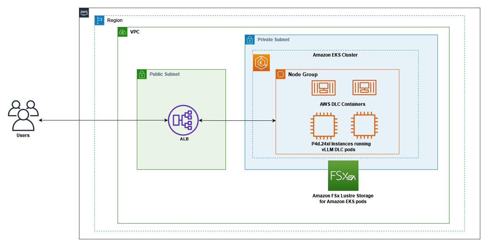

# vLLM Deepseek Model on EKS with GPU Support, EFA, and FSx Lustre Integration

This repository contains scripts and configuration files to deploy a deepseek model using the AWS public vLLM deep learning container ECR image on an Amazon EKS cluster with GPU support (p4d.24xlarge instances with NVIDIA A100 GPUs), Elastic Fabric Adapter (EFA) for high-performance networking, and FSx Lustre for persistent model storage.



## Prerequisites

Before getting started, ensure you have:
•	An AWS account with access to amazon EC2 P4 instances (you may need to request a quota increase)
•	Access to a terminal which has the below tools installed.
o	AWS CLI version 2.11.0 or later
o	eksctl version 0.150.0 or later
o	kubectl version 1.27 or later
o	Helm version 3.12.0 or later
•	Configure a new aws cli profile (vllm-profile) with an IAM role/user that has the following permissions
o	Create, manage, and delete EKS clusters and node groups
o	Create, manage, and delete EC2 resources including VPCs, subnets, security groups, and internet gateways
o	Create and manage IAM roles
o	Create, update, and delete CloudFormation stacks
o	Create, delete, and describe FSx file systems
o	Create and manage Elastic Load Balancers

### Regional Availability
This solution can be deployed in any region where Amazon EKS, P4d instances, and Amazon FSx for Lustre are available. This guide uses the us-west-2 (Oregon) region.

### Setting Up AWS Profile for a New Account

If you're deploying to a new AWS account, you'll need to create a new AWS profile:

```bash
# Create a new AWS profile
aws configure --profile vllm-profile

# For temporary credentials, also add the session token
echo -e "\naws_session_token = YOUR_SESSION_TOKEN_HERE" >> ~/.aws/credentials
```

You'll need to provide:
- AWS Access Key ID
- AWS Secret Access Key
- Default region (e.g., us-west-2)
- Default output format (e.g., json, table)
- Session token (if using temporary credentials)


### Installation Instructions

#### Install AWS CLI
```bash
# For Linux
curl "https://awscli.amazonaws.com/awscli-exe-linux-x86_64.zip" -o "awscliv2.zip"
unzip awscliv2.zip
sudo ./aws/install

# Configure AWS CLI
aws configure
```

#### Install eksctl
```bash
# For Linux
curl --silent --location "https://github.com/weaveworks/eksctl/releases/latest/download/eksctl_$(uname -s)_amd64.tar.gz" | tar xz -C /tmp
sudo mv /tmp/eksctl /usr/local/bin
eksctl version

# For macOS
brew tap weaveworks/tap
brew install weaveworks/tap/eksctl
```

#### Install kubectl
```bash
# For Linux
curl -LO "https://dl.k8s.io/release/$(curl -L -s https://dl.k8s.io/release/stable.txt)/bin/linux/amd64/kubectl"
chmod +x kubectl
sudo mv kubectl /usr/local/bin/

# For macOS
brew install kubectl
```

#### Install Helm
```bash
# For Linux
curl https://raw.githubusercontent.com/helm/helm/main/scripts/get-helm-3 | bash

# For macOS
brew install helm
```

## Files

- `cleanup.sh`: Script for cleaning up all resources created by this deployment
- `eks-cluster.yaml`: EKS cluster configuration
- `fsx-inspect-pod.yaml`: Pod definition for inspecting FSx Lustre filesystem
- `fsx-lustre-pv.yaml`: Persistent Volume for FSx Lustre
- `fsx-lustre-pvc.yaml`: Persistent Volume Claim for FSx Lustre
- `fsx-storage-class.yaml`: Storage class for FSx Lustre
- `iam-policy.json`: IAM policy document for the AWS Load Balancer Controller
- `large-model-nodegroup.yaml`: Nodegroup configuration for p4d.24xlarge instances with EFA support
- `vllm-deepseek-32b-lws.yaml`: LeaderWorkerSet configuration for the vLLM server with deepseek model
- `vllm-deepseek-32b-lws-ingress.yaml`: Kubernetes ingress for the vLLM server with ALB

## Setup

This section provides step-by-step instructions to deploy the vLLM Deepseek model on Amazon EKS with GPU support, EFA, and FSx Lustre integration. Follow these steps in order to set up your environment.

### Create an EKS cluster

First, we create an EKS cluster in the us-west-2 Region using the provided configuration file:

```bash
# Update the region in eks-cluster.yaml if needed
sed -i "s|region: us-east-1|region: us-west-2|g" eks-cluster.yaml

# Create the EKS cluster
eksctl create cluster -f eks-cluster.yaml --profile vllm-profile
```

**Timeline:** This will take approximately 15-20 minutes to complete. During this time, eksctl creates a CloudFormation stack that provisions the necessary resources for your EKS cluster.

You can validate the cluster creation with:

```bash
# Verify cluster creation
eksctl get cluster --profile vllm-profile
```

### Create a node group with EFA support

Next, we create a managed node group with P4d.24xlarge instances that have EFA enabled:

```bash
# Get the VPC ID from the EKS cluster
VPC_ID=$(aws --profile vllm-profile eks describe-cluster --name vllm-cluster \
  --query "cluster.resourcesVpcConfig.vpcId" --output text)

# Find the one of private subnet's availability zone
PRIVATE_AZ=$(aws --profile vllm-profile ec2 describe-subnets \
  --filters "Name=vpc-id,Values=$VPC_ID" "Name=map-public-ip-on-launch,Values=false" \
  --query "Subnets[0].AvailabilityZone" --output text)
echo "Selected private subnet AZ: $PRIVATE_AZ"

# update the nodegroup_az section with the private AZ value
sed -i "s|availabilityZones: \[nodegroup_az\]|availabilityZones: \[\"$PRIVATE_AZ\"\]|g" large-model-nodegroup.yaml

# Verify the change
grep "availabilityZones" large-model-nodegroup.yaml

# Create the node group with EFA support
eksctl create nodegroup -f large-model-nodegroup.yaml --profile vllm-profile
```

**Timeline:** This will take approximately 10-15 minutes to complete. The EFA configuration is particularly important for multi-node deployments.

After the node group is created, configure kubectl to connect to the cluster:

```bash
# Configure kubectl to connect to the cluster
aws eks update-kubeconfig --name vllm-cluster --region us-west-2 --profile vllm-profile
```

Verify that the nodes are ready:

```bash
# Check node status
kubectl get nodes
```

### Check NVIDIA device pods

Verify that the NVIDIA device plugin is running:

```bash
# Check NVIDIA device plugin pods
kubectl get pods -n kube-system | grep nvidia
```

Verify that GPUs are available in the cluster:

```bash
# Check available GPUs
kubectl get nodes -o json | jq '.items[].status.capacity."nvidia.com/gpu"'
```

### Create an FSx for Lustre file system

For optimal performance, we create an FSx for Lustre file system to store our model weights:

```bash
# Create a security group for FSx Lustre
FSX_SG_ID=$(aws --profile vllm-profile ec2 create-security-group --group-name fsx-lustre-sg \
  --description "Security group for FSx Lustre" \
  --vpc-id $(aws --profile vllm-profile eks describe-cluster --name vllm-cluster \
  --query "cluster.resourcesVpcConfig.vpcId" --output text) \
  --query "GroupId" --output text)

echo "Created security group: $FSX_SG_ID"

# Add inbound rules for FSx Lustre
aws --profile vllm-profile ec2 authorize-security-group-ingress --group-id $FSX_SG_ID \
  --protocol tcp --port 988-1023 \
  --source-group $(aws --profile vllm-profile eks describe-cluster --name vllm-cluster \
  --query "cluster.resourcesVpcConfig.clusterSecurityGroupId" --output text)

aws --profile vllm-profile ec2 authorize-security-group-ingress --group-id $FSX_SG_ID \
     --protocol tcp --port 988-1023 \
     --source-group $FSX_SG_ID

# Create the FSx Lustre filesystem
SUBNET_ID=$(aws --profile vllm-profile eks describe-cluster --name vllm-cluster \
  --query "cluster.resourcesVpcConfig.subnetIds[0]" --output text)

echo "Using subnet: $SUBNET_ID"

FSX_ID=$(aws --profile vllm-profile fsx create-file-system --file-system-type LUSTRE \
  --storage-capacity 1200 --subnet-ids $SUBNET_ID \
  --security-group-ids $FSX_SG_ID --lustre-configuration DeploymentType=SCRATCH_2 \
  --tags Key=Name,Value=vllm-model-storage \
  --query "FileSystem.FileSystemId" --output text)

echo "Created FSx filesystem: $FSX_ID"

# Wait for the filesystem to be available (typically takes 5-10 minutes)
echo "Waiting for filesystem to become available..."
aws --profile vllm-profile fsx describe-file-systems --file-system-id $FSX_ID \
  --query "FileSystems[0].Lifecycle" --output text

# You can run the above command periodically until it returns "AVAILABLE"
# Example: watch -n 30 "aws --profile vllm-profile fsx describe-file-systems --file-system-id $FSX_ID --query FileSystems[0].Lifecycle --output text"

# Get the DNS name and mount name
FSX_DNS=$(aws --profile vllm-profile fsx describe-file-systems --file-system-id $FSX_ID \
  --query "FileSystems[0].DNSName" --output text)

FSX_MOUNT=$(aws --profile vllm-profile fsx describe-file-systems --file-system-id $FSX_ID \
  --query "FileSystems[0].LustreConfiguration.MountName" --output text)

echo "FSx DNS: $FSX_DNS"
echo "FSx Mount Name: $FSX_MOUNT"
```

### Install the AWS FSx CSI Driver

To mount the FSx for Lustre file system in our Kubernetes pods:

```bash
# Add the AWS FSx CSI Driver Helm repository
helm repo add aws-fsx-csi-driver https://kubernetes-sigs.github.io/aws-fsx-csi-driver/
helm repo update

# Install the AWS FSx CSI Driver
helm install aws-fsx-csi-driver aws-fsx-csi-driver/aws-fsx-csi-driver --namespace kube-system
```

Verify that the AWS FSx CSI Driver is running:

```bash
# Check AWS FSx CSI Driver pods
kubectl get pods -n kube-system | grep fsx
```

### Create Kubernetes resources for FSx for Lustre

We create the necessary Kubernetes resources to use our FSx for Lustre file system:

```bash
# Update the storage class with your subnet and security group IDs
sed -i "s|<subnet-id>|$SUBNET_ID|g" fsx-storage-class.yaml
sed -i "s|<sg-id>|$FSX_SG_ID|g" fsx-storage-class.yaml

# Update the PV with your FSx Lustre details
sed -i "s|<fs-id>|$FSX_ID|g" fsx-lustre-pv.yaml
sed -i "s|<fs-id>.fsx.us-west-2.amazonaws.com|$FSX_DNS|g" fsx-lustre-pv.yaml
sed -i "s|<mount-name>|$FSX_MOUNT|g" fsx-lustre-pv.yaml

# Apply the Kubernetes resources
kubectl apply -f fsx-storage-class.yaml
kubectl apply -f fsx-lustre-pv.yaml
kubectl apply -f fsx-lustre-pvc.yaml
```

Verify that the resources were created successfully:

```bash
# Check storage class
kubectl get sc fsx-sc

# Check persistent volume
kubectl get pv fsx-lustre-pv

# Check persistent volume claim
kubectl get pvc fsx-lustre-pvc
```

### Install the AWS Load Balancer Controller

To expose our vLLM service to the outside world:

```bash
# Download the IAM policy document
curl -o iam-policy.json https://raw.githubusercontent.com/kubernetes-sigs/aws-load-balancer-controller/main/docs/install/iam_policy.json

# Create the IAM policy
aws --profile vllm-profile iam create-policy --policy-name AWSLoadBalancerControllerIAMPolicy --policy-document file://iam-policy.json

# Create an IAM OIDC provider for the cluster
eksctl utils associate-iam-oidc-provider --profile vllm-profile --region=us-west-2 --cluster=vllm-cluster --approve

# Create an IAM service account for the AWS Load Balancer Controller
ACCOUNT_ID=$(aws --profile vllm-profile sts get-caller-identity --query "Account" --output text)
eksctl create iamserviceaccount \
  --profile vllm-profile \
  --cluster=vllm-cluster \
  --namespace=kube-system \
  --name=aws-load-balancer-controller \
  --attach-policy-arn=arn:aws:iam::$ACCOUNT_ID:policy/AWSLoadBalancerControllerIAMPolicy \
  --override-existing-serviceaccounts \
  --approve

# Install the AWS Load Balancer Controller using Helm
helm repo add eks https://aws.github.io/eks-charts
helm repo update

# Install the CRDs
kubectl apply -f https://raw.githubusercontent.com/aws/eks-charts/master/stable/aws-load-balancer-controller/crds/crds.yaml

# Install the controller
helm install aws-load-balancer-controller eks/aws-load-balancer-controller \
  -n kube-system \
  --set clusterName=vllm-cluster \
  --set serviceAccount.create=false \
  --set serviceAccount.name=aws-load-balancer-controller

# Install the LeaderWorkerSet controller
helm install lws oci://registry.k8s.io/lws/charts/lws \
  --version=0.6.1 \
  --namespace lws-system \
  --create-namespace \
  --wait --timeout 300s
```

Verify that the AWS Load Balancer Controller is running:

```bash
# Check AWS Load Balancer Controller pods
kubectl get pods -n kube-system | grep aws-load-balancer-controller
```

### Configure security groups for the ALB

We create a dedicated security group for the ALB:

```bash
# Create security group for the ALB
USER_IP=$(curl -s https://checkip.amazonaws.com)

VPC_ID=$(aws --profile vllm-profile eks describe-cluster --name vllm-cluster \
  --query "cluster.resourcesVpcConfig.vpcId" --output text)

ALB_SG=$(aws --profile vllm-profile ec2 create-security-group \
  --group-name vllm-alb-sg \
  --description "Security group for vLLM ALB" \
  --vpc-id $VPC_ID \
  --query "GroupId" --output text)

echo "ALB security group: $ALB_SG"

# Allow inbound traffic on port 80 from your IP
aws --profile vllm-profile ec2 authorize-security-group-ingress \
  --group-id $ALB_SG \
  --protocol tcp \
  --port 80 \
  --cidr ${USER_IP}/32

# Get the node group security group ID
NODE_INSTANCE_ID=$(aws --profile vllm-profile ec2 describe-instances \
  --filters "Name=tag:eks:nodegroup-name,Values=vllm-p4d-nodes-efa" \
  --query "Reservations[0].Instances[0].InstanceId" --output text)

NODE_SG=$(aws --profile vllm-profile ec2 describe-instances \
  --instance-ids $NODE_INSTANCE_ID \
  --query "Reservations[0].Instances[0].SecurityGroups[0].GroupId" --output text)

echo "Node security group: $NODE_SG"

# Allow traffic from ALB security group to node security group on port 8000 (vLLM service port)
aws --profile vllm-profile ec2 authorize-security-group-ingress \
  --group-id $NODE_SG \
  --protocol tcp \
  --port 8000 \
  --source-group $ALB_SG

# Update the security group in the ingress file
sed -i "s|<sg-id>|$ALB_SG|g" vllm-deepseek-32b-lws-ingress.yaml
```

### Deploy the vLLM server

Finally, we deploy the vLLM server using the LeaderWorkerSet pattern:

```bash
# Deploy the vLLM server
# First, verify that the AWS Load Balancer Controller is running
kubectl get pods -n kube-system | grep aws-load-balancer-controller

# Wait until the controller is in Running state
# If it's not running, check the logs:
# kubectl logs -n kube-system deployment/aws-load-balancer-controller

# Apply the LeaderWorkerSet
kubectl apply -f vllm-deepseek-32b-lws.yaml
```

**Timeline:** The deployment will start immediately, but the pod might remain in ContainerCreating state for several minutes (5-15 minutes) while it pulls the large GPU-enabled container image. After the container starts, it will take additional time (10-15 minutes) to download and load the DeepSeek model.

You can monitor the progress with:

```bash
# Monitor pod status
kubectl get pods

# Check pod logs
kubectl logs -f <pod-name>
```

We also deploy an ingress resource that configures the ALB to route traffic to our vLLM service:

```bash
# Apply the ingress (only after the controller is running)
kubectl apply -f vllm-deepseek-32b-lws-ingress.yaml
```

You can check the status of the ingress with:

```bash
# Check ingress status
kubectl get ingress
```

### Test the deployment

When the deployment is complete, we can test our vLLM server:

```bash
# Test the vLLM server
# Get the ALB endpoint
export VLLM_ENDPOINT=$(kubectl get ingress vllm-deepseek-32b-lws-ingress -o jsonpath='{.status.loadBalancer.ingress[0].hostname}')
echo "vLLM endpoint: $VLLM_ENDPOINT"

# Test the completions API
curl -X POST http://$VLLM_ENDPOINT/v1/completions \
  -H "Content-Type: application/json" \
  -d '{
      "model": "deepseek-ai/DeepSeek-R1-Distill-Qwen-32B",
      "prompt": "Hello, how are you?",
      "max_tokens": 100,
      "temperature": 0.7
  }'
```

You can also test the chat completions API:

```bash
# Test the chat completions API
curl -X POST http://$VLLM_ENDPOINT/v1/chat/completions \
  -H "Content-Type: application/json" \
  -d '{
      "model": "deepseek-ai/DeepSeek-R1-Distill-Qwen-32B",
      "messages": [{"role": "user", "content": "What are the benefits of using FSx Lustre with EKS?"}],
      "max_tokens": 100,
      "temperature": 0.7
  }'
```

**Note:** The ALB creation typically takes 2-5 minutes to provision and become available with a DNS name.

The vLLM server provides several API endpoints compatible with the OpenAI API:
- `/v1/completions` - For text completions
- `/v1/chat/completions` - For chat completions
- `/v1/embeddings` - For generating embeddings
- `/v1/models` - For listing available models

## Cleanup

You can clean up all resources created in this deployment using either the provided cleanup script or by following the detailed manual steps below.

### Using the Cleanup Script

For a simplified cleanup process, you can use the provided cleanup.sh script:

```bash
# Make the script executable
chmod +x cleanup.sh

# Run the cleanup script
./cleanup.sh
```

This script will automatically delete all resources in the correct order, with appropriate wait times between steps to ensure proper deletion. The script handles:
- Kubernetes resources (ingress, LeaderWorkerSet, PVC, PV, AWS Load Balancer Controller)
- IAM resources (service accounts and policies)
- FSx for Lustre file system
- Security groups
- EKS node group
- EKS cluster

### Manual Cleanup Steps

If you prefer to clean up resources manually or need more control over the process, follow these steps in order:

### 1. Delete Kubernetes Resources

```bash
# Delete the vLLM ingress
kubectl delete -f vllm-deepseek-32b-lws-ingress.yaml

# Delete the vLLM LeaderWorkerSet
kubectl delete -f vllm-deepseek-32b-lws.yaml

# Delete the FSx Lustre PVC and PV
kubectl delete -f fsx-lustre-pvc.yaml
kubectl delete -f fsx-lustre-pv.yaml

# Delete the storage class
kubectl delete -f fsx-storage-class.yaml

# Delete the AWS Load Balancer Controller
helm uninstall aws-load-balancer-controller -n kube-system

# Verify all Kubernetes resources are deleted
kubectl get pods,svc,ingress,pv,pvc
```

### 2. Delete the IAM Service Account CloudFormation Stack

```bash
# Delete the CloudFormation stack for the IAM service account
aws --profile vllm-profile cloudformation delete-stack --stack-name eksctl-vllm-cluster-addon-iamserviceaccount-kube-system-aws-load-balancer-controller

# Verify the stack is being deleted
aws --profile vllm-profile cloudformation describe-stacks --stack-name eksctl-vllm-cluster-addon-iamserviceaccount-kube-system-aws-load-balancer-controller --query "Stacks[0].StackStatus" --output text || echo "Stack deleted"
```

### 3. Delete the IAM Policy

```bash
# Get the ARN of the IAM policy
POLICY_ARN=$(aws --profile vllm-profile iam list-policies --query "Policies[?PolicyName=='AWSLoadBalancerControllerIAMPolicy'].Arn" --output text)

# Delete the IAM policy
aws --profile vllm-profile iam delete-policy --policy-arn $POLICY_ARN
```

### 4. Delete the FSx Lustre Filesystem

```bash
# Get the FSx Lustre filesystem ID if not already set
if [ -z "$FSX_ID" ]; then
  FSX_ID=$(aws --profile vllm-profile fsx describe-file-systems --query "FileSystems[?Tags[?Key=='Name' && Value=='vllm-model-storage']].FileSystemId" --output text)
  echo "Found FSx Lustre filesystem ID: $FSX_ID"
fi

# Delete the FSx Lustre filesystem
# Timeline: FSx Lustre deletion takes 5-10 minutes
aws --profile vllm-profile fsx delete-file-system --file-system-id $FSX_ID

# Verify the filesystem is deleted
aws --profile vllm-profile fsx describe-file-systems --file-system-id $FSX_ID || echo "Filesystem deleted"
```

### 5. Check for Any Remaining Load Balancers

```bash
# Check for any remaining ALBs or NLBs
aws --profile vllm-profile elbv2 describe-load-balancers

# Check for any remaining Classic ELBs
aws --profile vllm-profile elb describe-load-balancers
```

### 6. Delete the Node Group

It's recommended to delete the node group separately before deleting the cluster, especially when using p4d.24xlarge instances with EFA and system pods that may be difficult to evict:

```bash
# First, check the status of the node group
eksctl get nodegroup --cluster=vllm-cluster --region=us-west-2 --profile=vllm-profile

# Delete the node group without draining (recommended approach)
# This skips the pod eviction process which can get stuck with system pods
eksctl delete nodegroup --cluster=vllm-cluster --name=vllm-p4d-nodes-efa --region=us-west-2 --profile=vllm-profile --drain=false

# Verify the node group deletion is in progress
aws --profile vllm-profile cloudformation list-stacks --stack-status-filter DELETE_IN_PROGRESS --query "StackSummaries[?contains(StackName, 'vllm-p4d-nodes-efa')].{Name:StackName, Status:StackStatus}" --output table

# Verify the node group is deleted (this command should return "Node group deleted" when complete)
eksctl get nodegroup --cluster=vllm-cluster --name=vllm-p4d-nodes-efa --region=us-west-2 --profile=vllm-profile 2>&1 | grep -q "not found" && echo "Node group deleted"
```

**Note:** Using the `--drain=false` flag is important when deleting node groups with p4d.24xlarge instances, as system pods like EFA device plugins, NVIDIA device plugins, and CSI drivers may prevent normal draining operations.

### 7. Delete the Security Groups

```bash
# Delete the security group created for the ALB
aws --profile vllm-profile ec2 delete-security-group --group-id $ALB_SG

# Verify the ALB security group is deleted
aws --profile vllm-profile ec2 describe-security-groups --group-ids $ALB_SG 2>&1 | grep -q "InvalidGroup.NotFound" && echo "ALB security group deleted"

# Delete the security group created for FSx Lustre
aws --profile vllm-profile ec2 delete-security-group --group-id $SG_ID

# Verify the FSx security group is deleted
aws --profile vllm-profile ec2 describe-security-groups --group-ids $SG_ID 2>&1 | grep -q "InvalidGroup.NotFound" && echo "FSx security group deleted"
```

### 8. Delete the EKS Cluster

```bash
# Delete the EKS cluster
# Timeline: EKS cluster deletion takes 10-15 minutes
eksctl delete cluster --name=vllm-cluster --region=us-west-2 --profile=vllm-profile

# Verify the cluster is deleted
aws --profile vllm-profile eks describe-cluster --name vllm-cluster 2>&1 | grep -q "ResourceNotFoundException" && echo "Cluster deleted"
```

### 9. Troubleshooting CloudFormation Stack Deletion Failures

EKS cluster CloudFormation stack deletion often fails on the VPC deletion step. Common issues include pending default security group cleanup and route table dependencies. Follow these steps to troubleshoot and resolve these issues:

```bash
# Check the status of the CloudFormation stacks
aws --profile vllm-profile cloudformation list-stacks --stack-status-filter DELETE_FAILED --query "StackSummaries[?contains(StackName, 'vllm-cluster')].{Name:StackName, Status:StackStatus}" --output table

# Identify the resources that failed to delete
aws --profile vllm-profile cloudformation describe-stacks --stack-name <stack-name> --query "Stacks[0].StackStatusReason" --output text

# Get the VPC ID
VPC_ID=$(aws --profile vllm-profile ec2 describe-vpcs --filters "Name=tag:Name,Values=*vllm-cluster*" --query "Vpcs[0].VpcId" --output text)

# Check for network interfaces still attached to the VPC (these prevent deletion)
aws --profile vllm-profile ec2 describe-network-interfaces --filters "Name=vpc-id,Values=$VPC_ID" --query "NetworkInterfaces[*].[NetworkInterfaceId, SubnetId, Description]" --output table

# For VPC endpoint issues, identify and delete VPC endpoints
ENDPOINT_IDS=$(aws --profile vllm-profile ec2 describe-vpc-endpoints --filters "Name=vpc-id,Values=$VPC_ID" --query "VpcEndpoints[*].VpcEndpointId" --output text)

# Delete VPC endpoints
for endpoint in $ENDPOINT_IDS; do
  aws --profile vllm-profile ec2 delete-vpc-endpoints --vpc-endpoint-ids $endpoint
done

# Check for default security group rules that need to be removed
DEFAULT_SG=$(aws --profile vllm-profile ec2 describe-security-groups --filters "Name=vpc-id,Values=$VPC_ID" "Name=group-name,Values=default" --query "SecurityGroups[0].GroupId" --output text)

# Remove all ingress and egress rules from the default security group
aws --profile vllm-profile ec2 revoke-security-group-ingress --group-id $DEFAULT_SG --protocol all --source-group $DEFAULT_SG || echo "No ingress rules to delete"
aws --profile vllm-profile ec2 revoke-security-group-egress --group-id $DEFAULT_SG --protocol all --cidr 0.0.0.0/0 || echo "No egress rules to delete"

# Check for route tables with dependencies
aws --profile vllm-profile ec2 describe-route-tables --filters "Name=vpc-id,Values=$VPC_ID" --query "RouteTables[*].[RouteTableId,Associations[*].RouteTableAssociationId]" --output table

# Disassociate route tables if needed
# aws --profile vllm-profile ec2 disassociate-route-table --association-id rtbassoc-XXXXXXXXXXXXXXXXX

# Retry the CloudFormation stack deletion
aws --profile vllm-profile cloudformation delete-stack --stack-name <stack-name>
```

### 10. Verify All Resources Are Deleted

```bash
# Verify no EKS clusters remain
aws --profile vllm-profile eks list-clusters

# Verify no FSx Lustre filesystems remain
aws --profile vllm-profile fsx describe-file-systems

# Verify no CloudFormation stacks remain
aws --profile vllm-profile cloudformation list-stacks --stack-status-filter CREATE_COMPLETE UPDATE_COMPLETE DELETE_FAILED --query "StackSummaries[?contains(StackName, 'vllm-cluster')].{Name:StackName, Status:StackStatus}" --output table
```

## Monitoring

You can monitor the deployment with:

```bash
# Check if the pods are running
kubectl get pods

# Check the logs of the vLLM pod
kubectl logs -f daemonset/vllm-deepseek-32b

# Get the ALB endpoint
kubectl get ingress vllm-deepseek-32b-ingress
```

## Notes

- The deployment uses p4d.24xlarge instances with NVIDIA A100 GPUs
- The nodes are configured with Elastic Fabric Adapter (EFA) for high-performance networking between nodes
- The vLLM server is configured to use 85% of the GPU memory. You can adjust this in the `vllm-deepseek-32b-lws.yaml` file.
- The service is exposed using an Application Load Balancer (ALB) through the AWS Load Balancer Controller. This provides better integration with AWS services and supports features like path-based routing and SSL termination.
- The max model length is set to 4096 tokens to fit in the GPU memory. You can adjust this in the `vllm-deepseek-32b-lws.yaml` file.
- The FSx Lustre filesystem is used to store the model weights, which provides faster loading times and persistent storage.
- The nodegroup uses an EKS-optimized AMI with GPU support which already includes the NVIDIA device plugin, eliminating the need for a separate Helm installation.

## LeaderWorkerSet Implementation

We've implemented the LeaderWorkerSet (LWS) pattern to fix the vLLM node parallelism issue. This approach provides several advantages over the DaemonSet approach:

1. **Better Control Over Pod Placement**: LWS allows us to explicitly define which nodes should run the leader and worker pods.
2. **Improved Ray Cluster Formation**: The leader pod starts the Ray head node, and worker pods connect to it using the leader's address.
3. **Proper Pipeline Parallelism**: With LWS, we can configure tensor parallelism (TP=8) and pipeline parallelism (PP=2) to utilize both nodes effectively.

### Key Configuration Files

- `vllm-deepseek-32b-lws.yaml`: Contains the LeaderWorkerSet configuration with leader and worker templates
- `vllm-deepseek-32b-lws-ingress.yaml`: Contains the ingress configuration for the ALB

### Ray Cluster Configuration

The Ray cluster is configured as follows:
- Leader node: Starts Ray with `--head --port=6379 --num-cpus=48 --num-gpus=8`
- Worker node: Connects to the leader with `--address=$(LWS_LEADER_ADDRESS):6379 --num-cpus=48 --num-gpus=8`

### vLLM Server Configuration

The vLLM server is configured with:
- Tensor parallelism: 8 (utilizing all GPUs on a single node)
- Pipeline parallelism: 2 (distributing the model across 2 nodes)
- GPU memory utilization: 85%
- Max model length: 4096 tokens

### Troubleshooting AWS Load Balancer Controller

If you encounter permission issues with the AWS Load Balancer Controller, check:
1. The IAM role ARN in the service account annotation
2. The IAM role ARN in the pod environment variables
3. The trust relationship policy for the IAM role

If there's a mismatch, restart the AWS Load Balancer Controller pods:
```bash
kubectl rollout restart deployment -n kube-system aws-load-balancer-controller
```

## Elastic Fabric Adapter (EFA) Configuration

This deployment uses Amazon's Elastic Fabric Adapter (EFA) technology, which is a network interface for Amazon EC2 instances that enables high-performance computing and machine learning applications to scale efficiently. EFA provides lower and more consistent latency and higher throughput than the TCP transport traditionally used in cloud-based HPC systems.

### EFA Setup in the Nodegroup

The `large-model-nodegroup.yaml` file (included in this repository) configures the p4d.24xlarge instances with EFA support:

```yaml
# Enable EFA interfaces
efaEnabled: true

# Add bootstrap commands to install EFA drivers
preBootstrapCommands:
  - |
    #!/bin/bash
    set -ex
    
    # Install EFA driver and related packages
    curl -O https://efa-installer.amazonaws.com/aws-efa-installer-latest.tar.gz
    tar -xf aws-efa-installer-latest.tar.gz
    cd aws-efa-installer
    ./efa_installer.sh -y
    
    # Configure NCCL to use EFA
    echo "export FI_PROVIDER=efa" >> /etc/environment
    echo "export FI_EFA_USE_DEVICE_RDMA=1" >> /etc/environment
    echo "export NCCL_DEBUG=INFO" >> /etc/environment
```

The EFA installation process:
1. Downloads and installs the EFA installer
2. Runs the installer with the `-y` flag to automatically accept all prompts
3. Configures environment variables to enable NCCL (NVIDIA Collective Communications Library) to use EFA for GPU-to-GPU communication

### Benefits of EFA for Large Language Models

- **Reduced latency**: EFA provides lower and more consistent latency for communication between GPUs across nodes
- **Higher throughput**: EFA enables higher throughput for data transfer between nodes
- **Improved scaling**: EFA allows large language models to scale more efficiently across multiple nodes
- **Better performance**: EFA can significantly improve the performance of distributed training and inference workloads

## Advanced Configuration: Using Application Load Balancer (ALB)

We've configured the vLLM service to use an Application Load Balancer (ALB) through the AWS Load Balancer Controller. This provides several advantages over a standard Kubernetes LoadBalancer service:

1. **Path-based routing**: ALB supports routing traffic to different services based on the URL path
2. **SSL/TLS termination**: ALB can handle SSL/TLS termination, reducing the load on your pods
3. **Authentication**: ALB supports authentication through Amazon Cognito or OIDC
4. **Web Application Firewall (WAF)**: ALB can be integrated with AWS WAF for additional security
5. **Access Logs**: ALB can log all requests to an S3 bucket for auditing and analysis

The ALB is configured through the `vllm-deepseek-32b-lws-ingress` file, which includes annotations for the AWS Load Balancer Controller. You can customize the ALB configuration by modifying these annotations.

### Security Group Configuration

The ALB security group must allow inbound traffic on port 80 (and 443 if using HTTPS) from the clients that will access the vLLM service. You can update the security group configuration in the `vllm-deepseek-32b-lws-ingress` file:

```yaml
alb.ingress.kubernetes.io/security-groups: <sg-id>
```

### SSL/TLS Configuration

To enable HTTPS, you can add the following annotations to the `vllm-deepseek-32b-lws-ingress` file:

```yaml
alb.ingress.kubernetes.io/listen-ports: '[{"HTTP": 80}, {"HTTPS": 443}]'
alb.ingress.kubernetes.io/certificate-arn: arn:aws:acm:region:account-id:certificate/certificate-id
alb.ingress.kubernetes.io/ssl-policy: ELBSecurityPolicy-2016-08
```

### Access Logs

To enable access logs, add the following annotation to the `vllm-deepseek-32b-lws-ingress` file:

```yaml
alb.ingress.kubernetes.io/load-balancer-attributes: access_logs.s3.enabled=true,access_logs.s3.bucket=your-bucket-name,access_logs.s3.prefix=your-prefix
```

## FSx Lustre Integration Benefits

1. **Persistent Storage**: Model weights are stored on the FSx Lustre filesystem and persist across pod restarts
2. **Faster Loading**: After the initial download, model loading will be much faster
3. **Shared Storage**: Multiple pods can access the same model weights
4. **High Performance**: FSx Lustre provides high-throughput, low-latency access to the model weights
